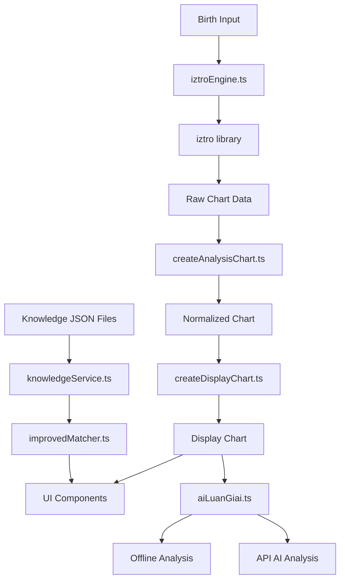
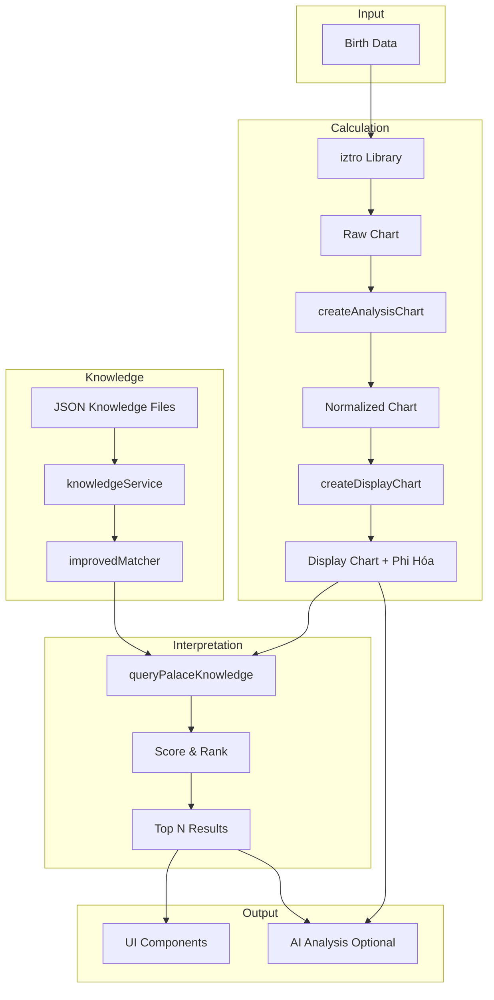
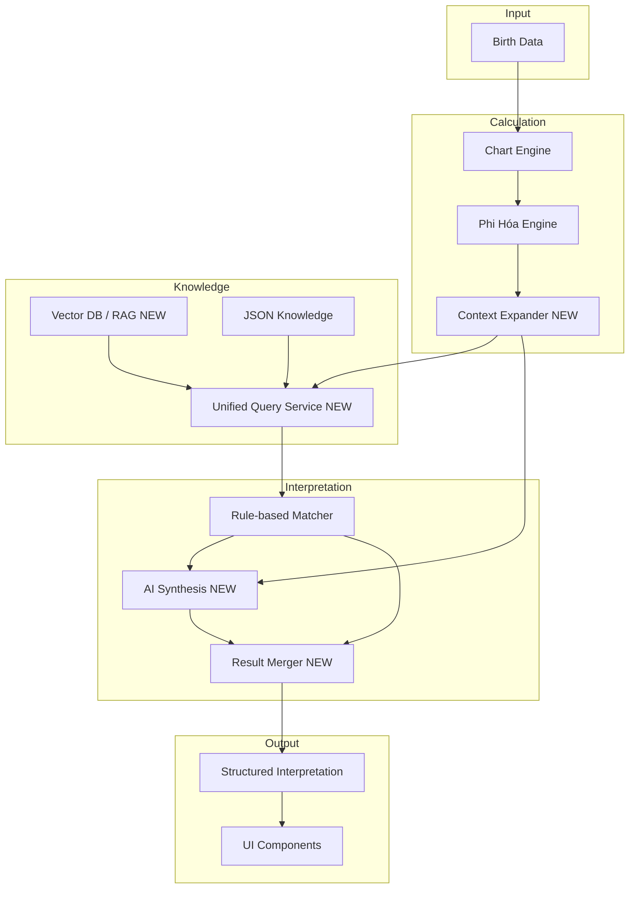
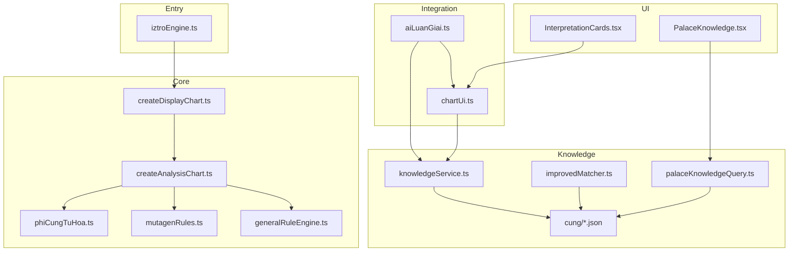

# AUDIT LOGIC LUẬN GIẢI TỬ VI

**Ngày tạo:** 2024
**Project:** LaSoTuVi
**Phạm vi:** Toàn bộ logic luận giải hiện có

---

# 1. Executive Summary

## Tổng quan hệ thống

Project LaSoTuVi là ứng dụng web lập lá số Tử Vi với các đặc điểm:

- **Frontend-only architecture**: Toàn bộ logic tính toán chạy trên client
- **Chart Engine**: Sử dụng thư viện `iztro` làm core, bọc lại với custom logic
- **Knowledge Base**: JSON files chứa tri thức luận giải được crawl từ nhiều nguồn
- **Interpretation Engine**: Rule-based matching giữa chart data và knowledge

## Các thành phần chính đã tìm thấy

| Thành phần | Trạng thái | File chính |
|------------|------------|------------|
| Chart Calculation | ✅ Đầy đủ | `src/lib/iztroEngine.ts` |
| Star Knowledge | ✅ Có | `src/lib/tuvi/knowledge/cung/*.json` |
| Palace Knowledge | ✅ Có | `src/lib/tuvi/knowledge/cung/*.json` |
| Tứ Hóa | ✅ Có | `src/lib/tuvi/rules/mutagenRules.ts` |
| Phi Hóa | ✅ Có | `src/lib/tuvi/rules/phiCungTuHoa.ts` |
| Thái Tuế | ⚠️ Một phần | `src/lib/tuvi/rules/generalRuleEngine.ts` |
| Tam hợp/Xung chiếu | ❌ Chưa có | NOT IMPLEMENTED |
| AI Integration | ✅ Có (optional) | `src/lib/aiLuanGiai.ts` |

---

# 2. Architecture hiện tại

## Flow tổng quan



## Dependency Graph

```
src/lib/
├── iztroEngine.ts          # Entry point - gọi iztro + createDisplayChart
├── types.ts                # Type definitions
├── chartUi.ts              # UI helpers + knowledge query
├── aiLuanGiai.ts           # AI analysis builder
└── tuvi/
    ├── createAnalysisChart.ts   # Core normalization
    ├── createDisplayChart.ts    # Display transformation
    ├── constants/tuHoa.ts       # Tứ Hóa mapping table
    ├── rules/
    │   ├── mutagenRules.ts      # Tứ Hóa rules by year stem
    │   ├── phiCungTuHoa.ts      # Phi Hóa calculation
    │   ├── generalRuleEngine.ts # An sao rules (Tuần, Triệt, etc.)
    │   └── resolveNatalMutagens.ts
    └── knowledge/
        ├── knowledgeService.ts      # Main query service
        ├── improvedMatcher.ts       # Matching logic
        ├── palaceKnowledgeQuery.ts  # Palace-specific query
        └── cung/*.json              # Knowledge data files
```

---

# 3. Chart Engine

## 3.1 Entry Point

**File:** `src/lib/iztroEngine.ts`
**Function:** `createChart(input, profileId, options)`

### Input
```typescript
type NormalizedBirthInput = {
  fullName: string;
  year: number;
  month: number;
  day: number;
  birthHour: number;
  birthMinute: number;
  birthHourIndex: number;
  gender: "male" | "female";
  calendarType: "solar" | "lunar";
};
```

### Output
```typescript
type ChartView = DisplayChart; // Full chart with 12 palaces
```

### Processing Steps
1. Gọi `iztro.astrolabeBySolarDate()` hoặc `astrolabeByLunarDate()`
2. Gọi `createDisplayChart()` để normalize và enrich

## 3.2 Chart Calculation Components

| Thành phần | File | Function | Input | Output |
|------------|------|----------|-------|--------|
| Raw Chart | `iztroEngine.ts` | `createChart` | BirthInput | Raw iztro data |
| Normalize | `createAnalysisChart.ts` | `normalizeChart` | Raw + Input + Config | NormalizedChart |
| An Mệnh/Thân | `generalRuleEngine.ts` | `anMenhThan` | lunarMonth, hourBranch | {menh, than} |
| 12 cung | `generalRuleEngine.ts` | `anFunctionalPalaces` | menhPalace | Palace map |
| Chính tinh | `generalRuleEngine.ts` | `anTuViGroup`, `anThienPhuGroup` | tuViPalace | Star[] |
| Phụ tinh | `generalRuleEngine.ts` | Multiple functions | Various | Star[] |
| Tứ Hóa | `mutagenRules.ts` | `MUTAGEN_RULES` | yearStem | Mutagen mapping |
| Phi Hóa | `phiCungTuHoa.ts` | `generatePhiTuHoaForChart` | palaces, yearStem | PhiResult[] |
| Tuần/Triệt | `generalRuleEngine.ts` | `anTuan`, `anTriet` | yearStem, yearBranch | Palace[] |

## 3.3 iztro Library Usage

Project sử dụng thư viện `iztro` (npm package) để:
- Tính toán vị trí sao
- Chuyển đổi lịch âm/dương
- Tính đại vận, tiểu vận

**Không tự implement** các công thức an sao cơ bản - dựa hoàn toàn vào iztro.


---

# 4. Data Model

## 4.1 Chart Schema (Thực tế từ code)

```typescript
DisplayChart
├── profile: ChartProfile
│   ├── fullName: string
│   ├── gender: string
│   ├── birthTime?: string
│   ├── solarDate?: string
│   ├── lunarDate?: string
│   ├── zodiac?: string
│   ├── soul?: string              // Mệnh chủ
│   ├── body?: string              // Thân chủ
│   ├── natalElementName?: string  // Nạp âm
│   ├── natalElement?: string      // Ngũ hành bản mệnh
│   ├── fiveElementsClass?: string // Cục
│   ├── yearStem?: string          // Thiên can năm sinh
│   ├── yearBranch?: string        // Địa chi năm sinh
│   └── laiNhanCung?: LaiNhanCung
├── palaces: DisplayPalace[]
│   ├── index: number
│   ├── name: string               // Tên cung (Mệnh, Phụ Mẫu, ...)
│   ├── heavenlyStem?: string      // Can cung
│   ├── earthlyBranch?: string     // Chi cung
│   ├── isBodyPalace: boolean
│   ├── decadalRange?: string      // Đại vận
│   ├── ages?: number[]            // Tiểu vận
│   ├── majorStars: DisplayStar[]  // Chính tinh
│   ├── minorStars: DisplayStar[]  // Phụ tinh
│   ├── goodStars: DisplayStar[]   // Cát tinh
│   ├── badStars: DisplayStar[]    // Sát tinh
│   ├── visibleStars: DisplayStar[]
│   ├── specialMarkers: SpecialMarker[] // Tuần, Triệt
│   └── phiTuHoa?: PhiResult       // Phi hóa từ cung này
├── palaceStemMap?: Record<string, string>
└── laiNhanCung?: LaiNhanCung
```

## 4.2 Star Schema

```typescript
DisplayStar
├── name: string
├── originalName?: string
├── scope: "origin" | "cycle" | "annual" | ...
├── source: "major" | "minor" | "mutagen" | ...
├── brightness?: "M" | "V" | "Đ" | "B" | "L" | "H" | ""
├── mutagen?: "Lộc" | "Quyền" | "Khoa" | "Kỵ"
├── colorGroup: StarColorGroup
├── targetStar?: string           // Cho Hóa tinh
└── displayColumn?: "center" | "left" | "right" | "bottom"
```

## 4.3 Phi Hóa Schema

```typescript
PhiResult
├── flows: PhiFlow[]
│   ├── sourcePalaceId: string
│   ├── sourcePalaceName: string
│   ├── sourceStem: string
│   ├── type: "loc" | "quyen" | "khoa" | "ky"
│   ├── typeLabel: string
│   ├── targetStar: string
│   ├── targetPalaceId: string | null
│   ├── targetPalaceName: string | null
│   ├── relation: "phi_nhap" | "tu_hoa" | "missing_star"
│   └── displayText: string
└── corner: { loc: string | null, ky: string | null }
```

---

# 5. Knowledge Architecture

## 5.1 Knowledge Sources

| Loại | File Pattern | Số lượng | Nguồn |
|------|--------------|----------|-------|
| Consolidated | `*-consolidated.json` | 12 files | Crawled + Deduplicated |
| CoHoc Full | `*-cohoc-full.json` | 12 files | tuvi.cohoc.net |
| Manual | `menh.json`, `tai-bach.json`, etc. | ~10 files | Curated |
| Star Combinations | `star-combinations.json` | 1 file | Curated |

## 5.2 Knowledge File Schema

```typescript
// File: src/lib/tuvi/knowledge/cung/*.json
KnowledgeFile
├── palace: string
├── palace_name?: string
├── sections?: KnowledgeSection[]
│   ├── section_id: string
│   ├── title: string
│   └── interpretations: KnowledgeInterpretation[]
└── interpretations?: KnowledgeInterpretation[]

KnowledgeInterpretation
├── id: string
├── type: string                    // "star_in_palace", "phi_hoa", etc.
├── conditions?: InterpretationConditions
│   ├── required_stars?: string[]
│   ├── meeting_stars?: string[]
│   ├── position?: string[]         // Địa chi
│   ├── heavenly_stem?: string      // Thiên can
│   ├── mutagen_in_palace?: string | string[]
│   ├── transformation?: string
│   ├── source_palace?: string
│   └── target_palace?: string
├── text: string                    // Nội dung luận giải
└── source: KnowledgeSource
    ├── book: string
    ├── author: string
    └── translator?: string
```

## 5.3 Knowledge Registry

**File:** `src/lib/tuvi/knowledge/knowledgeService.ts`

```typescript
const PALACE_KNOWLEDGE: Record<string, KnowledgeFile[]> = {
  menh: [STAR_COMBINATIONS, menhConsolidated, menhData, ...],
  phu_mau: [STAR_COMBINATIONS, phuMauConsolidated],
  phu_the: [STAR_COMBINATIONS, phuTheConsolidated, phuTheData],
  phuc_duc: [STAR_COMBINATIONS, phucDucConsolidated, phucDucData],
  dien_trach: [STAR_COMBINATIONS, dienTrachConsolidated, dienTrachData],
  quan_loc: [STAR_COMBINATIONS, quanLocConsolidated, ...],
  no_boc: [STAR_COMBINATIONS, noBocConsolidated],
  thien_di: [STAR_COMBINATIONS, thienDiConsolidated, thienDiData],
  tat_ach: [STAR_COMBINATIONS, tatAchConsolidated],
  tai_bach: [STAR_COMBINATIONS, taiBachConsolidated, taiBachData],
  tu_tuc: [STAR_COMBINATIONS, tuTucConsolidated, tuTucData],
  huynh_de: [STAR_COMBINATIONS, huynhDeConsolidated],
};
```

## 5.4 Knowledge Types

| Type | Mô tả | Ví dụ |
|------|-------|-------|
| `star_in_palace` | Sao tại cung | "Thất Sát tại Mệnh" |
| `star_combination` | Tổ hợp sao | "Tử Phủ Vũ Tướng" |
| `phi_loc/quyen/khoa/ky` | Phi hóa | "Mệnh phi Lộc nhập Tài" |
| `position` | Vị trí cung | "Mệnh an tại Tuất" |
| `heavenly_stem` | Can cung | "Cung can Giáp" |
| `mutagen_in_palace` | Hóa tọa thủ | "Có Hóa Lộc tọa thủ" |
| `general` | Tổng quan | Luận giải chung |


---

# 6. Retrieval Logic

## 6.1 Main Query Function

**File:** `src/lib/tuvi/knowledge/knowledgeService.ts`
**Function:** `queryPalaceKnowledge(context)`

### Input Context
```typescript
type PalaceQueryContext = {
  palace: DisplayPalace;
  starsInPalace: string[];
  branch: string;                    // Địa chi cung
  heavenlyStem?: string;             // Can cung
  mutagensInPalace?: string[];       // Hóa tọa thủ
  phiHoaFlows?: PhiHoaFlow[];        // Phi hóa từ cung
};
```

### Query Flow
```
1. Normalize palace name → palace_id
2. Load knowledge files for palace_id
3. Flatten all interpretations from sections
4. For each interpretation:
   - Try matcher by type (star_in_palace, phi_hoa, etc.)
   - Calculate match score
   - Collect match reasons
5. Sort by score descending
6. Dedupe by text similarity
7. Return top 10 matches
```

## 6.2 Matchers

| Matcher | File | Function | Score Range |
|---------|------|----------|-------------|
| Star in Palace | `knowledgeService.ts` | `matchStarInPalace` | 10-30 |
| Meeting Stars | `knowledgeService.ts` | `matchMeetingStars` | 6-12 |
| Heavenly Stem | `knowledgeService.ts` | `matchHeavenlyStem` | 8 |
| Mutagen in Palace | `knowledgeService.ts` | `matchMutagenInPalace` | 8-15 |
| Phi Hoa | `knowledgeService.ts` | `matchPhiHoa` | 20 |

## 6.3 Improved Matcher (New System)

**File:** `src/lib/tuvi/knowledge/improvedMatcher.ts`

### Score Weights
```typescript
const SCORE_WEIGHTS = {
  STAR_COMBINATION_EXACT: 150,    // Tổ hợp sao đầy đủ
  STAR_COMBINATION_PARTIAL: 60,   // Một phần tổ hợp
  PHI_HOA_EXACT: 120,             // Phi hóa đúng type + target
  PHI_HOA_TYPE_ONLY: 40,          // Chỉ đúng type
  MAIN_STAR_SINGLE: 80,           // 1 chính tinh
  MAIN_STAR_MULTIPLE: 100,        // 2+ chính tinh
  POSITION_EXACT: 45,             // Đúng địa chi
  STEM_EXACT: 40,                 // Đúng thiên can
  POSITION_AND_STEM: 55,          // Đúng cả hai
  M_CODE_EXACT: 50,               // M_CODE match
  MINOR_STAR: 30,                 // Phụ tinh
  SAME_PALACE_BONUS: 20,          // Sao đồng cung
  GENDER_MATCH_BONUS: 15,         // Đúng giới tính
  EXCLUDED_STAR_PENALTY: -50,     // Có sao bị loại trừ
};
```

### Priority Order
1. `star_combination` (150+)
2. `phi_hoa` (120)
3. `main_star` (80-100)
4. `position_stem` (40-55)
5. `m_code` (50)
6. `minor_star` (30)
7. `general` (fallback)

---

# 7. Interpretation Rules

## 7.1 Rule Types Found

### A. Star-based Rules
```
IF star X IN palace Y
THEN return interpretation Z
```

**Example:**
```json
{
  "type": "star_in_palace",
  "conditions": {
    "required_stars": ["Thất Sát"]
  },
  "text": "Thất Sát thủ Mệnh, tính cách cương nghị..."
}
```

### B. Combination Rules
```
IF stars [A, B, C] ALL IN same palace
THEN return interpretation
```

**Example:**
```json
{
  "type": "star_combination",
  "conditions": {
    "required_stars": ["Tử Vi", "Thiên Phủ"],
    "same_palace": true
  },
  "text": "Tử Phủ đồng cung, quý cách..."
}
```

### C. Position Rules
```
IF palace.branch = X AND palace.stem = Y
THEN return interpretation
```

**Example:**
```json
{
  "type": "position",
  "conditions": {
    "position": ["Tuất"],
    "heavenly_stem": "Giáp"
  },
  "text": "Cung Mệnh an tại Giáp Tuất..."
}
```

### D. Phi Hoa Rules
```
IF palace A phi [Lộc/Quyền/Khoa/Kỵ] TO palace B
THEN return interpretation
```

**Example:**
```json
{
  "type": "phi_loc",
  "conditions": {
    "transformation": "loc",
    "source_palace": "menh",
    "target_palace": "tai_bach"
  },
  "text": "Mệnh phi Lộc nhập Tài Bạch..."
}
```

## 7.2 Rule Priority / Conflict Resolution

**Current Implementation:**

1. **Score-based sorting**: Kết quả được sắp xếp theo `matchScore` giảm dần
2. **Type priority**: Cùng score thì ưu tiên theo type (star_combination > phi_hoa > main_star > ...)
3. **Deduplication**: Loại bỏ kết quả có text tương tự (similarity > 0.6)
4. **Limit**: Chỉ trả về top 10 kết quả

**KHÔNG có:**
- Explicit priority field trong rules
- Override mechanism
- Conflict detection

## 7.3 Rule Execution

```typescript
// File: knowledgeService.ts
function queryPalaceKnowledge(context): KnowledgeMatch[] {
  // 1. Get all interpretations
  const allInterpretations = getAllInterpretations(files);
  
  // 2. Try each matcher
  for (const { interp, section } of allInterpretations) {
    let match = null;
    switch (interp.type) {
      case "star_in_palace":
        match = matchStarInPalace(interp, context);
        break;
      case "phi_hoa":
        match = matchPhiHoa(interp, context);
        break;
      // ... other types
    }
    if (match && match.score > 0) {
      results.push({ interpretation: interp, matchScore: match.score, ... });
    }
  }
  
  // 3. Sort and dedupe
  return deduped.slice(0, 10);
}
```


---

# 8. Tứ Hóa

## 8.1 Implementation Status: ✅ ĐẦY ĐỦ

## 8.2 Tứ Hóa Mapping Table

**File:** `src/lib/tuvi/constants/tuHoa.ts`

```typescript
export const TU_HOA_TABLE = {
  Giáp: { loc: "Liêm Trinh", quyen: "Phá Quân", khoa: "Vũ Khúc", ky: "Thái Dương" },
  Ất:   { loc: "Thiên Cơ",   quyen: "Thiên Lương", khoa: "Tử Vi", ky: "Thái Âm" },
  Bính: { loc: "Thiên Đồng", quyen: "Thiên Cơ", khoa: "Văn Xương", ky: "Liêm Trinh" },
  Đinh: { loc: "Thái Âm",    quyen: "Thiên Đồng", khoa: "Thiên Cơ", ky: "Cự Môn" },
  Mậu:  { loc: "Tham Lang",  quyen: "Thái Âm", khoa: "Hữu Bật", ky: "Thiên Cơ" },
  Kỷ:   { loc: "Vũ Khúc",    quyen: "Tham Lang", khoa: "Thiên Lương", ky: "Văn Khúc" },
  Canh: { loc: "Thái Dương", quyen: "Vũ Khúc", khoa: "Thái Âm", ky: "Thiên Đồng" },
  Tân:  { loc: "Cự Môn",     quyen: "Thái Dương", khoa: "Văn Khúc", ky: "Văn Xương" },
  Nhâm: { loc: "Thiên Lương", quyen: "Tử Vi", khoa: "Tả Phụ", ky: "Vũ Khúc" },
  Quý:  { loc: "Phá Quân",   quyen: "Cự Môn", khoa: "Thái Âm", ky: "Tham Lang" },
};
```

## 8.3 Tứ Hóa Resolution

**File:** `src/lib/tuvi/rules/resolveNatalMutagens.ts`

```typescript
function resolveNatalMutagens(chart, rule) {
  // 1. Lấy mapping từ yearStem
  // 2. Tìm cung chứa sao đích
  // 3. Gắn mutagen vào sao
  // 4. Tạo mutagenStar (Hóa Lộc, Hóa Quyền, ...)
}
```

## 8.4 Trường phái

**Hiện tại:** Chỉ có 1 bảng Tứ Hóa (Bắc Phái standard)
**Không có:** Phân biệt Nam Phái / các trường phái khác

---

# 9. Phi Hóa

## 9.1 Implementation Status: ✅ ĐẦY ĐỦ

## 9.2 Phi Hóa Calculation

**File:** `src/lib/tuvi/rules/phiCungTuHoa.ts`

### Main Function
```typescript
function generatePhiTuHoaForPalace(
  sourcePalace: NormalizedPalace,
  palaces: NormalizedPalace[],
  palaceStemMap?: Record<string, string>
): PhiResult
```

### Logic
1. Lấy Can cung nguồn (heavenlyStem)
2. Tra bảng TU_HOA_TABLE theo Can
3. Với mỗi loại hóa (Lộc, Quyền, Khoa, Kỵ):
   - Tìm sao đích trong bảng
   - Tìm cung chứa sao đích (chỉ tìm sao gốc - natal stars)
   - Xác định relation: `phi_nhap` (khác cung) hoặc `tu_hoa` (cùng cung)

### Output
```typescript
{
  flows: [
    {
      sourcePalaceName: "Mệnh",
      sourceStem: "Giáp",
      type: "loc",
      typeLabel: "Hóa Lộc",
      targetStar: "Liêm Trinh",
      targetPalaceName: "Quan Lộc",
      relation: "phi_nhap",
      displayText: "Mệnh phi Hóa Lộc nhập Quan Lộc tại Liêm Trinh"
    },
    // ... 3 flows khác
  ],
  corner: { loc: "Quan", ky: "Tài" }
}
```

## 9.3 Phi Hóa Data Storage

Phi Hóa được tính và lưu vào mỗi palace:
```typescript
palace.phiTuHoa = generatePhiTuHoaForPalace(palace, allPalaces);
palace.corner = palace.phiTuHoa.corner;
```

## 9.4 Phi Hóa trong Knowledge

Knowledge files có rules cho Phi Hóa:
- `menh-phi-hoa.json`
- `quan-loc-phi-hoa.json`
- Các `*-consolidated.json` cũng chứa phi hóa blocks

---

# 10. Thái Tuế

## 10.1 Implementation Status: ⚠️ MỘT PHẦN

## 10.2 Thái Tuế Năm Sinh

**File:** `src/lib/tuvi/rules/generalRuleEngine.ts`

```typescript
const THAI_TUE_RING = [
  { starKey: "thai_tue", displayName: "Thái Tuế" },
  { starKey: "thieu_duong", displayName: "Thiếu Dương" },
  { starKey: "tang_mon", displayName: "Tang Môn" },
  // ... 12 sao vòng Thái Tuế
];

function anVongThaiTue(yearBranch: string): NatalRuleStar[] {
  return buildRing("Vòng Thái Tuế", THAI_TUE_RING, yearBranch, "forward", "natal", "ring");
}
```

**Có:** An vòng Thái Tuế theo năm sinh

## 10.3 Thái Tuế Lưu Niên

**File:** `src/lib/aiLuanGiai.ts`

```typescript
thaiTueNhapQuai?: {
  method?: string;
  yearBranch?: string;
  thaiTuePalace?: string;
  activatedPalaces?: string[];
  activatedStars?: string[];
  observations?: Array<{...}>;
}
```

**Có:** Structure cho Thái Tuế Nhập Quái trong AI payload
**Chưa có:** Logic tính toán chi tiết Thái Tuế Nhập Quái

## 10.4 NOT IMPLEMENTED

- Thái Tuế Nhập Quái calculation
- Thái Tuế kích hoạt cung
- Logic luận giải Thái Tuế chi tiết

---

# 11. Tam hợp / Xung chiếu / Giáp cung

## 11.1 Implementation Status: ❌ CHƯA CÓ

## 11.2 Hiện trạng

**KHÔNG TÌM THẤY** implementation cho:
- Tam hợp cung (Tý-Thìn-Thân, Dần-Ngọ-Tuất, ...)
- Xung chiếu (đối cung)
- Giáp cung (2 cung kề)
- Hội chiếu (tam hợp + đối cung)

## 11.3 Related Code Found

**File:** `src/lib/tuvi/rules/generalRuleEngine.ts`

```typescript
// Chỉ có function tính đối cung
function oppositePalace(palace: string): PalaceName {
  return nextPalace(palace, 6);
}
```

**Không có:**
- Function lấy tam hợp cung
- Function lấy giáp cung
- Logic tổng hợp sao từ các cung liên quan

## 11.4 Knowledge References

Trong knowledge files có mention đến tam hợp/xung chiếu:
```json
{
  "conditions": {
    "meeting_stars": ["Tử Vi", "Thiên Phủ"]  // Hội chiếu
  }
}
```

**Nhưng:** Logic matching chỉ check trong `starsInPalace` (cùng cung), KHÔNG check tam hợp/xung chiếu thực sự.


---

# 12. Vận hạn

## 12.1 Đại Vận

**Implementation:** ✅ CÓ (từ iztro)

**File:** `src/lib/tuvi/createAnalysisChart.ts`

```typescript
const decadalRange = Array.isArray(palace?.decadal?.range)
  ? `${palace.decadal.range[0]}-${palace.decadal.range[1]}`
  : palace?.decadalRange;
```

**Data:** Mỗi cung có `decadalRange` (ví dụ: "2-11", "12-21", ...)

## 12.2 Tiểu Vận

**Implementation:** ✅ CÓ (từ iztro)

```typescript
const ages = Array.isArray(palace?.ages) 
  ? palace.ages.filter((age) => typeof age === "number") 
  : undefined;
```

**Data:** Mỗi cung có `ages[]` chứa các tuổi tiểu vận

## 12.3 Lưu Niên

**Implementation:** ✅ CÓ

**File:** `src/lib/tuvi/rules/luuStarResolver.ts`

- Tính Lưu Tứ Hóa theo năm xem
- Tính các sao lưu niên
- Hiển thị trên lá số

## 12.4 Lưu Nguyệt / Lưu Nhật / Lưu Thời

**Implementation:** ⚠️ MỘT PHẦN

Có structure trong types nhưng chưa thấy logic tính toán chi tiết.

---

# 13. Trace 3 Case Thực Tế

## Case 1: Thất Sát tại Tài Bạch

### Trace Flow

```
INPUT: Chart với Thất Sát tại cung Tài Bạch

1. Chart Calculation
   └── iztroEngine.ts → createChart()
       └── iztro.astrolabeBySolarDate()
       └── createDisplayChart()
           └── createAnalysisChart()
               └── normalizePalace() → majorStars: [{name: "Thất Sát", ...}]

2. Knowledge Query
   └── aiLuanGiai.ts → queryKnowledgeForPalace(chart, "Tài Bạch")
       └── knowledgeService.ts → queryPalaceKnowledge(context)
           └── context.starsInPalace = ["Thất Sát", ...]
           └── getAllInterpretations(PALACE_KNOWLEDGE["tai_bach"])
           └── matchStarInPalace(interp, context)
               └── requiredStars = ["Thất Sát"]
               └── hasAllRequired = true
               └── score = 10 + 2 = 12

3. Rule Match
   └── File: tai-bach-consolidated.json
   └── Block: { type: "star_in_palace", required_stars: ["Thất Sát"], text: "..." }

4. Output
   └── KnowledgeMatch { interpretation, matchScore: 12, matchReasons: ["Có Thất Sát tại cung"] }

5. UI
   └── PalaceKnowledge.tsx → KnowledgeCard
```

## Case 2: Thất Sát + Kình Dương đồng cung

### Trace Flow

```
INPUT: Chart với Thất Sát và Kình Dương cùng cung Mệnh

1. Chart Calculation
   └── palace.majorStars = [{name: "Thất Sát"}]
   └── palace.minorStars = [{name: "Kình Dương"}]

2. Knowledge Query
   └── context.starsInPalace = ["Thất Sát", "Kình Dương", ...]
   └── getAllInterpretations(PALACE_KNOWLEDGE["menh"])

3. Matcher: Star Combination
   └── improvedMatcher.ts → matchStarCombination()
   └── conditions.samePalaceStars = ["Thất Sát", "Kình Dương"]
   └── matched = 2/2
   └── score = STAR_COMBINATION_EXACT + (2 * 10) = 170

4. Rule Match
   └── File: star-combinations.json
   └── Block: { 
         type: "star_combination",
         conditions: { same_palace_stars: ["Thất Sát", "Kình Dương"] },
         text: "Thất Sát Kình Dương đồng cung, tính cách cương liệt..."
       }

5. Output
   └── MatchResult { matchType: "star_combination", score: 170, ... }
```

## Case 3: Phi Hóa - Mệnh phi Lộc nhập Tài

### Trace Flow

```
INPUT: Chart với cung Mệnh can Giáp, Liêm Trinh tại Tài Bạch

1. Chart Calculation
   └── createAnalysisChart.ts
       └── generatePhiTuHoaForChart(palaces, "Giáp")
           └── generatePhiTuHoaForPalace(menhPalace, allPalaces)
               └── sourceStem = "Giáp"
               └── TU_HOA_TABLE["Giáp"].loc = "Liêm Trinh"
               └── findPalaceByOriginalStar(palaces, "Liêm Trinh")
                   └── Found in Tài Bạch
               └── relation = "phi_nhap" (khác cung)

2. Phi Hóa Data
   └── menhPalace.phiTuHoa = {
         flows: [{
           type: "loc",
           targetStar: "Liêm Trinh",
           targetPalaceName: "Tài Bạch",
           relation: "phi_nhap"
         }, ...]
       }

3. Knowledge Query
   └── context.phiHoaFlows = extractPhiHoaFlows(palace)
   └── matchPhiHoa(interp, context)
       └── flow.type === "loc" && flow.targetPalace === "tai_bach"
       └── score = PHI_HOA_EXACT = 120

4. Rule Match
   └── File: menh-phi-hoa.json
   └── Block: {
         type: "phi_loc",
         conditions: {
           transformation: "loc",
           source_palace: "menh",
           target_palace: "tai_bach"
         },
         text: "Mệnh phi Lộc nhập Tài Bạch, tài lộc hanh thông..."
       }

5. Output
   └── MatchResult { matchType: "phi_hoa", score: 120, ... }
```


---

# 14. Rule Priority / Conflict Resolution

## 14.1 Current Implementation

**Không có explicit priority system.** Thay vào đó dùng:

### Score-based Ranking
```typescript
// improvedMatcher.ts
results.sort((a, b) => {
  if (b.score !== a.score) return b.score - a.score;
  return typePriority[a.matchType] - typePriority[b.matchType];
});
```

### Type Priority Order
```typescript
const typePriority: Record<MatchType, number> = {
  star_combination: 0,  // Highest
  phi_hoa: 1,
  main_star: 2,
  position_stem: 3,
  m_code: 4,
  minor_star: 5,
  general: 6,           // Lowest
};
```

## 14.2 Conflict Handling

**Khi nhiều rules match:**
1. Tất cả đều được collect
2. Sort theo score
3. Dedupe theo text similarity (threshold 0.6)
4. Trả về top N (default 10)

**KHÔNG có:**
- Override mechanism
- Explicit conflict detection
- Rule exclusion logic

---

# 15. Duplicate / Dead Logic

## 15.1 Duplicate Knowledge Sources

| Cung | Số files | Potential Duplicates |
|------|----------|---------------------|
| Mệnh | 7 files | menh.json vs menh-consolidated.json |
| Quan Lộc | 5 files | quan-loc-co-ban.json vs quan-loc-consolidated.json |
| Tài Bạch | 3 files | tai-bach.json vs tai-bach-consolidated.json |

**Mitigation:** Deduplication trong query (text similarity check)

## 15.2 Duplicate Logic Locations

| Logic | Location 1 | Location 2 |
|-------|------------|------------|
| Star normalization | `normalizeStarName.ts` | `improvedMatcher.ts` |
| Palace normalization | `normalizePalaceName.ts` | `knowledgeService.ts` |
| Branch normalization | `normalizeBranch.ts` | `improvedMatcher.ts` |

## 15.3 Dead/Unused Code

| File | Status | Notes |
|------|--------|-------|
| `palaceInterpretation.ts` | Partially used | Only `menh` data loaded |
| `cohocLoader.ts` | Unused | Loader for cohoc format |
| `cohocParser.ts` | Unused | Parser for cohoc format |

## 15.4 Multiple Query Services

```
knowledgeService.ts          # Main service
improvedKnowledgeService.ts  # "Improved" version
palaceKnowledgeQuery.ts      # Another query interface
palaceInterpretation.ts      # Yet another interface
```

**Issue:** 4 different query interfaces, không rõ nên dùng cái nào.

---

# 16. Missing Logic

## 16.1 Summary Table

| Thành phần | Đã có | Chưa có | Không xác định |
|------------|-------|---------|----------------|
| Chart calculation | ✅ | | |
| Star knowledge | ✅ | | |
| Palace knowledge | ✅ | | |
| Star combination | ✅ | | |
| Tứ Hóa | ✅ | | |
| Phi Hóa | ✅ | | |
| Thái Tuế năm sinh | ✅ | | |
| Thái Tuế lưu niên | | ⚠️ Partial | |
| Thái Tuế Nhập Quái | | ❌ | |
| Tam hợp cung | | ❌ | |
| Xung chiếu | | ❌ | |
| Giáp cung | | ❌ | |
| Hội chiếu | | ❌ | |
| Context expansion | | ❌ | |
| AI interpretation | ✅ Optional | | |

## 16.2 Critical Missing Features

### 1. Tam hợp / Xung chiếu / Giáp cung
- Không có function tính các cung liên quan
- Không có logic tổng hợp sao từ tam hợp
- Knowledge có mention nhưng không được implement

### 2. Context Expansion
- Không thể từ 1 cung lấy ra các quan hệ xung quanh
- Không có "expand context" cho luận giải sâu

### 3. Thái Tuế Nhập Quái
- Có structure nhưng không có calculation
- Không có logic kích hoạt cung

---

# 17. Logic "Xung quanh Data"

## 17.1 Yêu cầu

Từ một điểm dữ liệu (ví dụ: cung Tài Bạch), lấy ra:
- Sao đồng cung
- Xung chiếu (đối cung)
- Tam hợp
- Giáp cung
- Tứ Hóa
- Phi Hóa
- Các tổ hợp liên quan

## 17.2 Hiện trạng

| Khả năng | Status | File/Function |
|----------|--------|---------------|
| Sao đồng cung | ✅ | `palace.visibleStars` |
| Xung chiếu | ❌ NOT IMPLEMENTED | - |
| Tam hợp | ❌ NOT IMPLEMENTED | - |
| Giáp cung | ❌ NOT IMPLEMENTED | - |
| Tứ Hóa tọa thủ | ✅ | `star.mutagen` |
| Phi Hóa từ cung | ✅ | `palace.phiTuHoa` |
| Phi Hóa nhập cung | ⚠️ Partial | Cần query ngược |

## 17.3 Có thể làm được

```typescript
// Sao đồng cung
const starsInPalace = palace.visibleStars.map(s => s.name);

// Tứ Hóa tọa thủ
const mutagens = palace.visibleStars
  .filter(s => s.mutagen)
  .map(s => ({ star: s.name, mutagen: s.mutagen }));

// Phi Hóa từ cung này
const phiHoaFlows = palace.phiTuHoa?.flows || [];
```

## 17.4 KHÔNG thể làm được (chưa implement)

```typescript
// ❌ Tam hợp cung
const tamHopPalaces = getTamHopPalaces(palace.earthlyBranch);
// NOT IMPLEMENTED

// ❌ Xung chiếu
const doiCung = getOppositePalace(palace);
const starsXungChieu = doiCung.visibleStars;
// NOT IMPLEMENTED (chỉ có oppositePalace() nhưng không dùng trong knowledge query)

// ❌ Giáp cung
const giapCungs = getAdjacentPalaces(palace);
// NOT IMPLEMENTED

// ❌ Tổng hợp context
const fullContext = expandPalaceContext(palace, chart);
// NOT IMPLEMENTED
```


---

# 18. Current Interpretation Pipeline

## 18.1 Pipeline Diagram



## 18.2 Data Flow Summary

```
1. INPUT
   └── BirthInput (year, month, day, hour, gender, calendar)

2. CALCULATION (iztro + custom)
   └── Raw Chart → Normalized → Analysis → Display
   └── Phi Hóa calculated per palace
   └── Tứ Hóa resolved to stars

3. KNOWLEDGE RETRIEVAL
   └── Load JSON files by palace
   └── Build query context (stars, branch, stem, phi hoa)
   └── Match against rules
   └── Score and rank

4. INTERPRETATION
   └── Top 10 matches per palace
   └── Deduplicated by text similarity

5. OUTPUT
   └── UI: PalaceKnowledge, InterpretationCards
   └── AI: buildOfflineAIAnalysis() or API call
```

---

# 19. AI Integration Point

## 19.1 Current AI Integration

**File:** `src/lib/aiLuanGiai.ts`

### Two Modes
1. **Offline Analysis** (`buildOfflineAIAnalysis`)
   - Sử dụng knowledge base local
   - Không cần API call
   - Fallback khi AI không khả dụng

2. **Online Analysis** (`generateLuanGiai`)
   - Gọi `/api/ai/luan-giai`
   - Gửi payload với chart data
   - Nhận kết quả từ AI service

### AI Payload Structure
```typescript
AIAnalysisPayload = {
  analysisMode: "basic" | "bac-phai",
  profile: { gender, birthDate, birthTime, ... },
  basicChart: { menh, than, cuc, amDuong, ... },
  palaces: PalaceSummary[],
  bacPhai: {
    natalFourTransformations,
    palaceStemMap,
    laiNhanCung,
    transformationFlows,
    ...
  },
  periods: { daiVan, luuNien },
  userQuestion?: string
}
```

## 19.2 Recommended AI Position

```
CURRENT SYSTEM
       ↓
[Chart Engine - iztro + custom]
       ↓
[Phi Hóa Calculation]
       ↓
[Knowledge Retrieval - JSON files]
       ↓
[Rule-based Matching]
       ↓
[Top N Interpretations]
       ↓
       ├──────────────────────┐
       ↓                      ↓
[Direct UI Display]    [AI Synthesis Layer] ← RECOMMENDED POSITION
                              ↓
                       [Enhanced Interpretation]
```

### Lý do đặt AI sau Rule-based Matching:

1. **Preserve existing logic**: Không phá vỡ logic hiện tại
2. **Context enrichment**: AI nhận được cả chart data + matched rules
3. **Quality control**: Rule-based results làm "ground truth" cho AI
4. **Fallback**: Nếu AI fail, vẫn có rule-based results

---

# 20. Recommended Target Architecture

## 20.1 Proposed Architecture



## 20.2 Key Additions Needed

### 1. Context Expander
```typescript
function expandPalaceContext(palace, chart): ExpandedContext {
  return {
    starsInPalace: [...],
    starsInTamHop: [...],      // NEW
    starsInXungChieu: [...],   // NEW
    starsInGiapCung: [...],    // NEW
    phiHoaIncoming: [...],     // NEW - phi hóa nhập cung này
    phiHoaOutgoing: [...],
    mutagensInContext: [...],
  };
}
```

### 2. Unified Query Service
```typescript
interface UnifiedKnowledgeService {
  queryByPalace(context: ExpandedContext): KnowledgeResult[];
  queryByStar(starName: string): KnowledgeResult[];
  queryByCombination(stars: string[]): KnowledgeResult[];
  queryByPhiHoa(flow: PhiHoaFlow): KnowledgeResult[];
}
```

### 3. AI Synthesis Layer
```typescript
interface AISynthesisService {
  synthesize(
    chartData: DisplayChart,
    ruleBasedResults: KnowledgeResult[],
    userQuestion?: string
  ): Promise<SynthesizedInterpretation>;
}
```

## 20.3 Migration Path

1. **Phase 1**: Implement Context Expander (tam hợp, xung chiếu, giáp cung)
2. **Phase 2**: Unify knowledge query services
3. **Phase 3**: Add RAG/Vector DB for better retrieval
4. **Phase 4**: Integrate AI synthesis layer
5. **Phase 5**: Enhance UI to show layered interpretations


---

# 21. File Dependency Map

## 21.1 Core Files

| File | Vai trò | Gọi bởi | Gọi tới | Quan trọng |
|------|---------|---------|---------|------------|
| `iztroEngine.ts` | Entry point | App.tsx, components | iztro, createDisplayChart | HIGH |
| `createAnalysisChart.ts` | Normalization | createDisplayChart | normalizers, rules | HIGH |
| `createDisplayChart.ts` | Display transform | iztroEngine | createAnalysisChart, starDisplay | HIGH |
| `phiCungTuHoa.ts` | Phi Hóa calc | createAnalysisChart | tuHoa constants | HIGH |
| `mutagenRules.ts` | Tứ Hóa rules | resolveNatalMutagens | - | HIGH |
| `generalRuleEngine.ts` | An sao rules | extraStarResolver | - | HIGH |

## 21.2 Knowledge Files

| File | Vai trò | Gọi bởi | Gọi tới | Quan trọng |
|------|---------|---------|---------|------------|
| `knowledgeService.ts` | Main query | aiLuanGiai, chartUi | JSON files | HIGH |
| `improvedMatcher.ts` | Matching logic | improvedKnowledgeService | - | MEDIUM |
| `palaceKnowledgeQuery.ts` | Palace query | PalaceKnowledge component | JSON files | MEDIUM |
| `cung/*.json` | Knowledge data | knowledgeService | - | HIGH |

## 21.3 UI Integration

| File | Vai trò | Gọi bởi | Gọi tới | Quan trọng |
|------|---------|---------|---------|------------|
| `aiLuanGiai.ts` | AI analysis | StreamingAnalysis | knowledgeService, chartUi | HIGH |
| `chartUi.ts` | UI helpers | components | knowledgeQuery | MEDIUM |
| `PalaceKnowledge.tsx` | Palace display | TuviChart | palaceKnowledgeQuery | MEDIUM |
| `InterpretationCards.tsx` | Quick readings | ResultDashboard | chartUi | MEDIUM |

## 21.4 Dependency Graph (Mermaid)



---

# 22. Kết luận - Trả lời 5 câu hỏi

## Q1: Project hiện tại tính lá số bằng logic nào?

**Answer:** Sử dụng thư viện `iztro` (npm package) làm core engine, bọc lại với custom logic trong:
- `src/lib/iztroEngine.ts` - Entry point
- `src/lib/tuvi/createAnalysisChart.ts` - Normalization
- `src/lib/tuvi/rules/*.ts` - Custom rules (Phi Hóa, brightness, etc.)

## Q2: Project hiện tại lấy tri thức luận giải từ đâu?

**Answer:** Từ JSON files trong `src/lib/tuvi/knowledge/cung/`:
- `*-consolidated.json` - Crawled từ tuvi.cohoc.net, deduplicated
- `*.json` - Curated manually
- `star-combinations.json` - Tổ hợp sao

Query qua `knowledgeService.ts` với rule-based matching.

## Q3: Project hiện tại kết hợp các dữ liệu xung quanh một cung/sao như thế nào?

**Answer:** **HẠN CHẾ**
- ✅ Có: Sao đồng cung, Tứ Hóa tọa thủ, Phi Hóa từ cung
- ❌ Không có: Tam hợp, Xung chiếu, Giáp cung, Hội chiếu
- ❌ Không có: Context expansion function

## Q4: Logic nào đang thực sự tạo ra luận giải?

**Answer:** 
1. **Rule-based matching** trong `knowledgeService.ts`:
   - Match stars in palace
   - Match position/stem
   - Match phi hóa
   - Score and rank
   
2. **Offline AI synthesis** trong `aiLuanGiai.ts`:
   - Combine knowledge results
   - Build structured output

## Q5: Nếu tích hợp Gemini, Gemini nên nằm ở vị trí nào?

**Answer:** Đặt **SAU rule-based matching**, **TRƯỚC UI output**:

```
Chart Data
    ↓
Phi Hóa Calculation
    ↓
Knowledge Retrieval (JSON)
    ↓
Rule-based Matching
    ↓
Top N Results
    ↓
[GEMINI/AI SYNTHESIS] ← ĐẶT Ở ĐÂY
    ↓
Enhanced Interpretation
    ↓
UI Display
```

**Lý do:**
1. Không phá logic hiện tại
2. AI nhận được context đầy đủ (chart + matched rules)
3. Rule-based results làm "ground truth"
4. Có fallback nếu AI fail

---

# 23. Appendix: Files Scanned

```
src/lib/
├── iztroEngine.ts ✓
├── types.ts ✓
├── chartUi.ts ✓
├── aiLuanGiai.ts ✓
└── tuvi/
    ├── createAnalysisChart.ts ✓
    ├── createDisplayChart.ts ✓
    ├── createTuviChart.ts ✓
    ├── constants/tuHoa.ts ✓
    ├── config/types.ts ✓
    ├── rules/
    │   ├── phiCungTuHoa.ts ✓
    │   ├── mutagenRules.ts ✓
    │   ├── resolveNatalMutagens.ts ✓
    │   └── generalRuleEngine.ts ✓
    └── knowledge/
        ├── index.ts ✓
        ├── types.ts ✓
        ├── knowledgeService.ts ✓
        ├── improvedMatcher.ts ✓
        ├── palaceInterpretation.ts ✓
        └── cung/*.json (listed)

src/components/
├── PalaceKnowledge.tsx ✓
└── InterpretationCards.tsx ✓
```

---

**END OF AUDIT REPORT**
